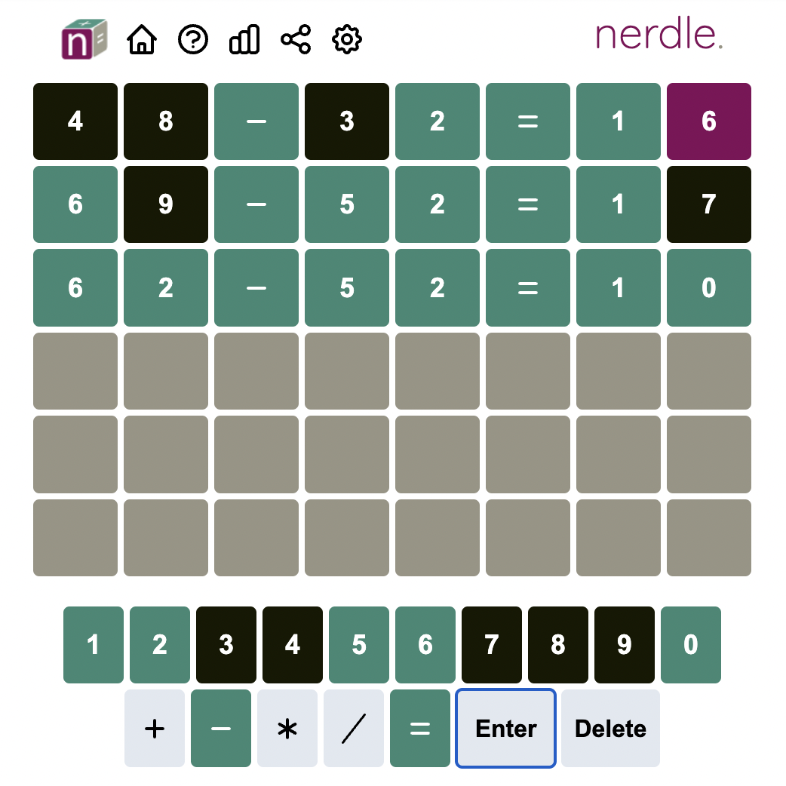

# Nerdle Solver

The aim of this code is to provide a solver for the game [Nerdle](https://nerdlegame.com/), that can beat the average human, not only in the number of tries, but also in speed.

And to make it "cooler", more visually appealing, and allow the user to rest and watch a robot do its magic for him, we made it so a bot would solve it live.

<video width="320" height="240" controls autoplay>
  <source src="./images/nerdle_bot.mov" type="video/mp4">
</video>


<!---
Inserir video
-->

The algorithm behind it, makes use of Information Theory techniques, which this video describes in detail how to do it for the Wordle game.

Inspired by it, I wanted to try this fascinating mechanism, but with Nerdle.

But what really triggered me to begin this was to beat my family, and ruin their fun ;)

## Rules
Nerdle is a game based on the core idea of Wordle, but using math operations instead of words.



The basic idea is to guess a mathematically valid operation. For each guess, the computer will assign each character with a color: red, green or black. This will give information about the solution. 

The meaning of each color is the following:
* green - correct character in the right place
* red - correct character in the wrong place
* black - character does not exist

To see more about the rules, check this link: https://faqs.nerdlegame.com/


## Installation

This code uses: 
* Python 3.10.2

To install the requirements, run the following command:
```bash
pip3 install -r requirements.txt
```

## Run bot solver

You can run a robot to solve in real-time a nerdle puzzle on the [official website](https://nerdlegame.com/) with:

```bash
python3 scrape.py
```

You may also run the bot for other nerdle game with:
```bash
python3 scrape.py --url https://instant.nerdlegame.com/
```

for the [instant](https://instant.nerdlegame.com/) version, for example.

Currently we support the [classic](https://nerdlegame.com/), the [instant](https://instant.nerdlegame.com/) and the [speed](https://speed.nerdlegame.com/) game types. The [mini](https://mini.nerdlegame.com/) game type is not yet done.

You may also run the bot to play for previous days. For instance, if you wish to play the instant version from 15/04/2022, you must run:

```bash
python3 scrape.py --url https://instant.nerdlegame.com/20220415
```
