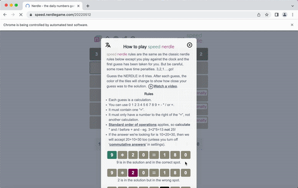
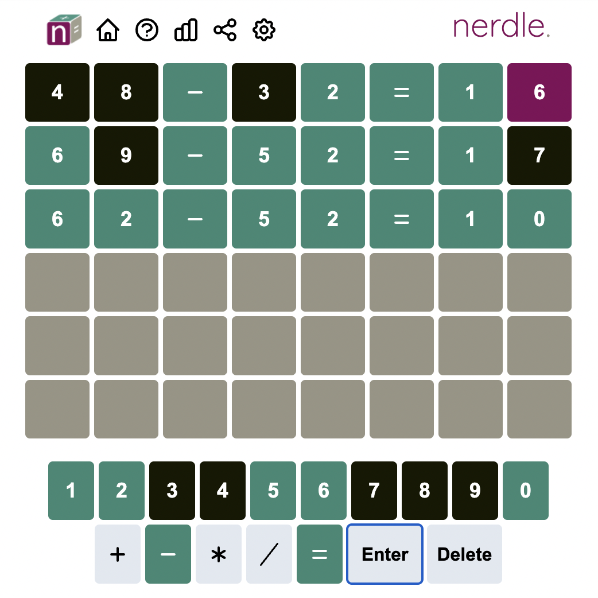
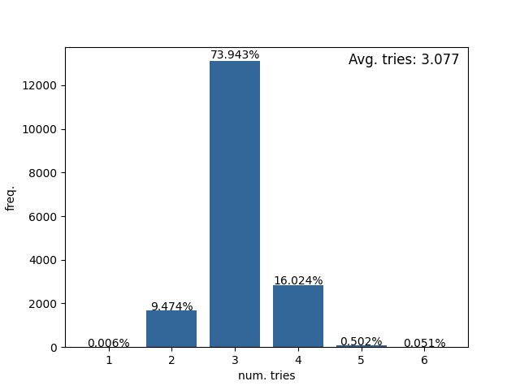
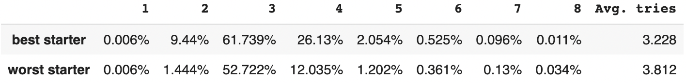
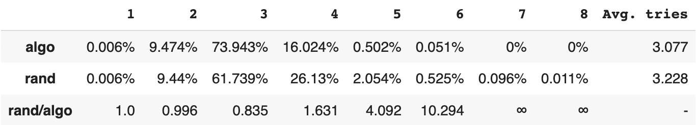
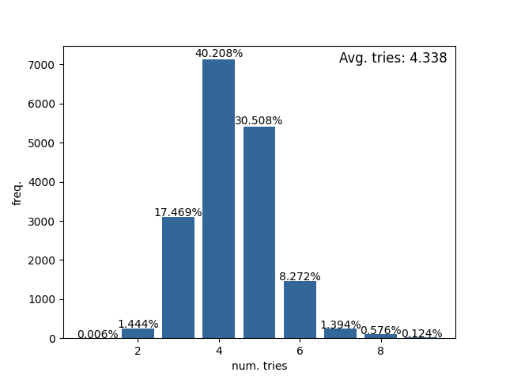
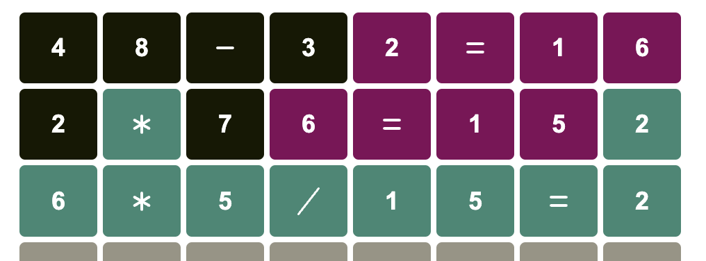

# Nerdle Solver

[Nerdle](https://nerdlegame.com/) is a game similar to [Wordle](https://wordlegame.org/), but with math operations, instead of words.

The Nerdle solver is capable of finding the most optimal plays, averaging 3.077 tries and with a 100% win rate for all 17,723 possible combinations.
We also found the optimal starting guess: 48-32=16.

Features:
* Bot that can instantly solve any Nerdle game, live on your browser
* Supports 3 game types: [Classic](https://nerdlegame.com/), [Instant](https://instant.nerdlegame.com/) and [Speed](https://speed.nerdlegame.com/)
* Suggestion of the best moves, through the command line
* Ability to simulate for any starting guess, and for different strategies, against all 17,723 combinations
* An extensive list of [all starting guesses scored](data/all_starting_guesses_scores.csv), from best to worst
* A study on the statistics of the game and the effects of this solver

<p align="center">

</p>

The algorithm behind it, makes use of Information Theory techniques, which this [video](https://www.youtube.com/watch?v=v68zYyaEmEA) describes in detail how to do it for the [Wordle](https://wordlegame.org/) game.

## Rules
Nerdle is a game based on the core idea of Wordle, but using math operations instead of words.

<p align="center">

</p>

The basic idea is to guess a mathematically valid operation. For each guess, the computer will assign each character with a color: red, green or black. This will give information about the solution. 

The meaning of each color is the following:
* green - correct character in the right place
* red - correct character in the wrong place
* black - character does not exist

To see more about the rules, check this link: https://faqs.nerdlegame.com/


## So, what is the best starter?

48-32=16.

From all the possible 17,723 starting combinations the combination with the highest entropy was "48-32=16". You can check all the starters ordered by score in [here](data/all_starting_guesses_scores.csv).

Starting with "48-32=16" and always playing the best suggestions from the algorithm, gives the following results:

<p align="center">

</p>

An average of 3.077 tries, where 83.423% of the solutions take 3 or less tries to complete. And zero cases with a loss (more than 6 tries).

#### How much does the starter matter?

Comparing the best starter (48-32=16) with the worst one (86*8=688), and playing randomly, gives the following results:

<p align="center">

</p>

The game is won in 2 tries 9.44% vs 1.44% (best vs worst starter), or 6.5x more often.

#### Playing randomly vs Optimal moves

If the user plays the optimal moves given by the algorithm vs plays it randomly (all with starter 48-32=16), the results are:

<p align="center">

</p>

Using the algo contributes for an improvement from 3.228 to 3.077 average tries. Or in other words, 83.423% vs 71.185% of the times with a win in 3 or less tries.

The number of wins with 2 tries is almost the same. The biggest diffence appearing with more tries. For 4 tries, random choice will happen 1.6x more often than with the algorithm; 4.1x more times for 5 tries; and 10.3x more times for 6 tries. The algorithm gets exponencially better, the longer the game goes on.

#### Just for fun: the worst possible plays

Just for fun, what would be the results for the worst possible plays? This means, the worst starter (86*8=688), combined with the lowest ranked suggestions given by the algorithm.

<p align="center">

</p>

(Being technically accurate, these are the low 1% suggestions, not the worst. As the simulation with the worst suggestion would take a very long time)

## Installation

This code uses: 
* Python 3.10.2

To install the requirements, run the following command:
```bash
pip3 install -r requirements.txt
```

## Usage

Currently we support 3 modes through the command line:
* `run_bot` - Which runs a bot that will open a browser and automatically solve any Nerdle game live.
* `play` - Will give the optimal suggestions on the command line.
* `simulation` - Allows you to simulate how well it performs given an initial guess, and will run it with all possible combinations, and display the statistics.

#### Running the bot solver

You can run a robot to solve in real-time a nerdle puzzle on the [official website](https://nerdlegame.com/) with:

```bash
python3 run.py -m scrape
```

You can also run the bot for other nerdle game with:
```bash
python3 run.py -m scrape --url https://instant.nerdlegame.com/
```

for the [instant](https://instant.nerdlegame.com/) version, for example.

Currently we support the [classic](https://nerdlegame.com/), the [instant](https://instant.nerdlegame.com/) and the [speed](https://speed.nerdlegame.com/) game types. The [mini](https://mini.nerdlegame.com/) game type is not yet done.

You may also run the bot to play for previous days. For instance, if you wish to play the instant version from 15/04/2022, you must run:

```bash
python3 run.py -m scrape --url https://instant.nerdlegame.com/20220415
```

#### Solve for an unknown solution

```bash
python3 run.py -m play
```

```bash
Best Guess: 48-32=16
Write new cmd: 4b 8b -b 3b 2r =r 1r 6r
List of possible combinations: ['1/6*12=2', '12*1/6=2', '12/6+7=9', ...] 62
Best Guess: 2*76=152
Write new cmd: 2b *g 7b 6r =r 1r 5r 2g
List of possible combinations: ['6*5/15=2', '5*6/15=2'] 2
Best Guess: 6*5/15=2
```

Corresponds to this game:

<p align="center">

</p>

The command must have 8 set of characters, where each set begins with the character played (0-9+-*/=), and the second character is the program's evaluation (g - green, r - red, b - black).
The 1st line in the image, corresponds to the cmd ```4b 8b -b 3b 2r =r 1r 6r```

#### Simulation

If you want to know how well will an initial guess perform, you must run the following command:

```bash
python3 run.py -m simulate --guess 48-32=16
```

And it will show the histogram of the results live, and at the end will save it.

You can also test for different strategies, for example, instead of always simulating the optimal moves, you can do it with random moves (similar to a human):

```bash
python3 run.py -m simulate --guess 48-32=16 --strategy random
```

#### Other

For more information about other parameters:

```bash
python3 run.py --help
```
